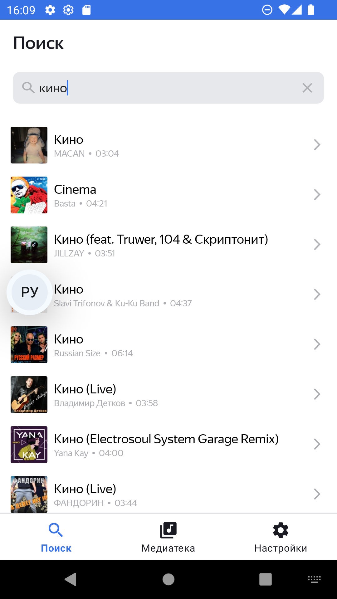
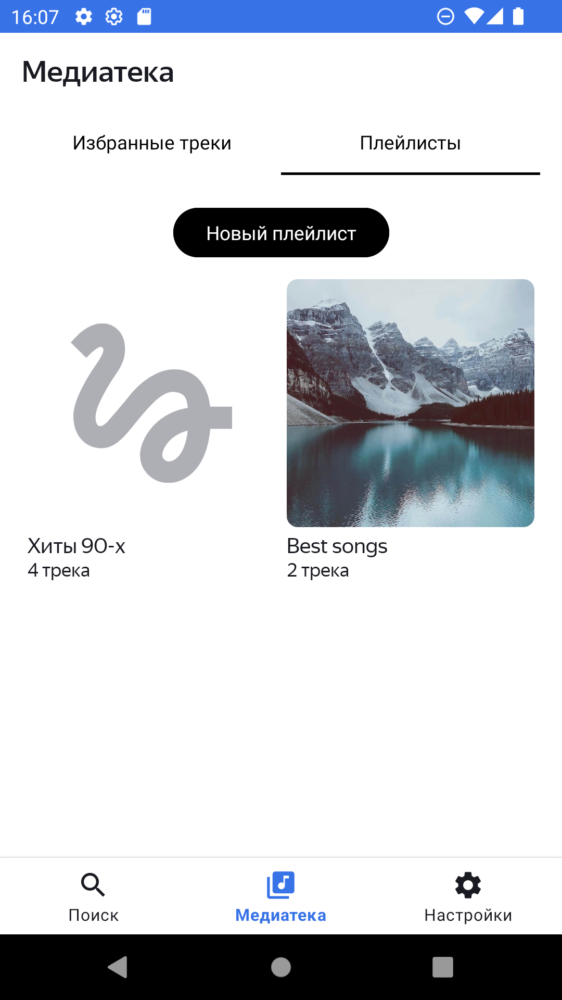
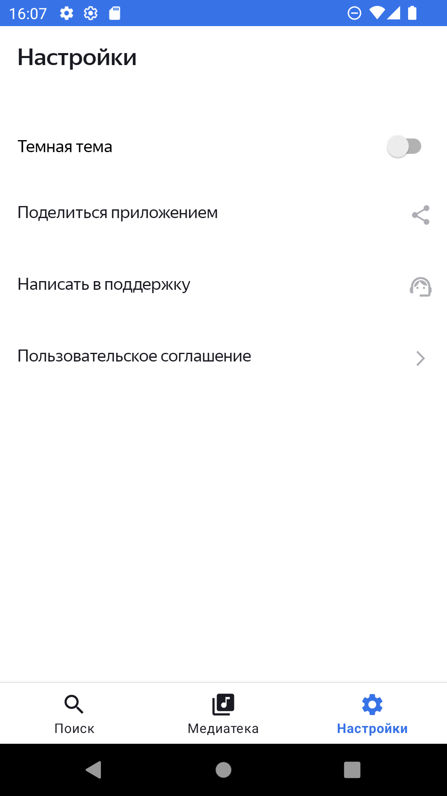

# Playlist Maker

**Playlist Maker** — это Android-приложение для создания и управления музыкальными плейлистами. Приложение включает интеграцию с Firebase для аналитики, использует Room для локального хранения данных и Retrofit для работы с внешними API. Проект написан на Kotlin и поддерживает асинхронные операции с помощью Coroutines.

## Функциональность
- 📂 **Создание и управление плейлистами** — создавайте, редактируйте и организуйте ваши плейлисты.
- 🔍 **Поиск треков** — находите нужные песни для своих плейлистов.
- 🎧 **Прослушивание отрывков** — прослушивайте 30 секундные отрывки треков.

       

## API
Приложение использует [iTunes API](https://developer.apple.com/library/archive/documentation/AudioVideo/Conceptual/iTuneSearchAPI/Searching.html#//apple_ref/doc/uid/TP40017632-CH5-SW1) для поиска музыки и получения данных о треках. Это позволяет пользователям находить треки по названию, артисту или альбому и прослушивать короткие фрагменты перед добавлением в плейлист.

## Используемые технологии и библиотеки
- **Firebase**: для отслеживания активности.
- **Kotlin Coroutines**: для асинхронных операций.
- **Navigation Component**: для управления навигацией.
- **Room**: для локального хранения данных.
- **Koin**: для внедрения зависимостей.
- **Retrofit и Gson**: для работы с API и парсинга JSON.
- **Glide**: для загрузки и отображения изображений.
